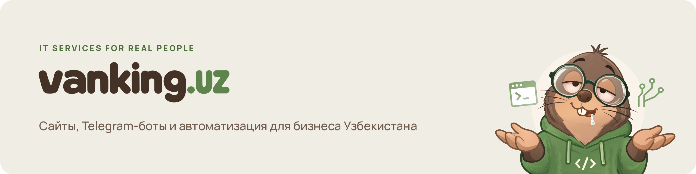
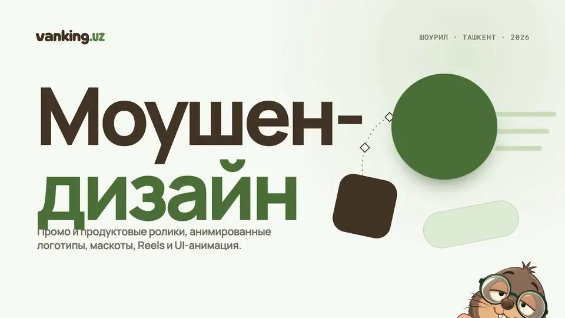

<picture>
  <source media="(prefers-color-scheme: dark)" srcset="./assets/banner-dark.png">
  
</picture>

### Что мы делаем

- **Сайты.** Лендинги, сайты компаний, каталоги товаров с заявкой.
- **Telegram-боты.** Приём заявок, заказы, запись клиентов.
- **Автоматизация.** Передача заявок в CRM, таблицы, уведомления.

#### Дизайн и видео

- **Дизайн.** Айдентика, графика для соцсетей, маскоты и персонажи.
- **Моушн и монтаж.** Промо-ролики, продуктовые видео, анимированные логотипы, Reels и Shorts, UI-анимация. Монтаж роликов и рекламы.

Работаем пакетами с понятным составом: заранее видно, что вы получите, что нужно от вас и как принимается результат. Нестандартные задачи оцениваем отдельно.

### Шоурил

<a href="https://vanking.uz/ru/services/motion-design">
  <picture>
    <source media="(prefers-reduced-motion: reduce)" srcset="./assets/showreel-poster.webp">
    
  </picture>
</a>

30 секунд, 24 стиля. Полная версия со звуком — на [vanking.uz](https://vanking.uz/ru/services/motion-design).

### Инструменты

  
  
  
  
  
  
  
  
  
  
  
  
  
  
  
  

### Связаться

- **Заявки:** Telegram-бот [@vanking_bot](https://t.me/vanking_bot)
- **Менеджер:** [@vanking_uz](https://t.me/vanking_uz) в Telegram
- **Сайт:** [vanking.uz](https://vanking.uz)
- **Почта:** [wankinguz@gmail.com](mailto:wankinguz@gmail.com)

RU · UZ
